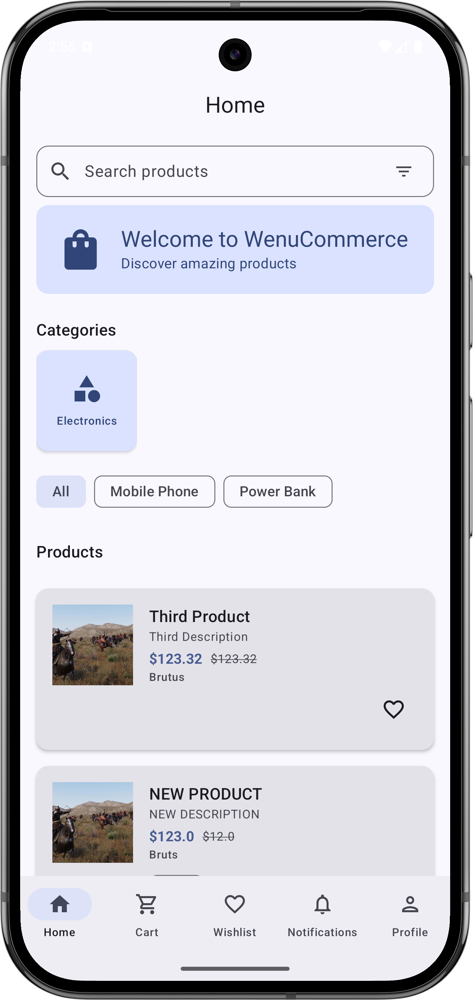
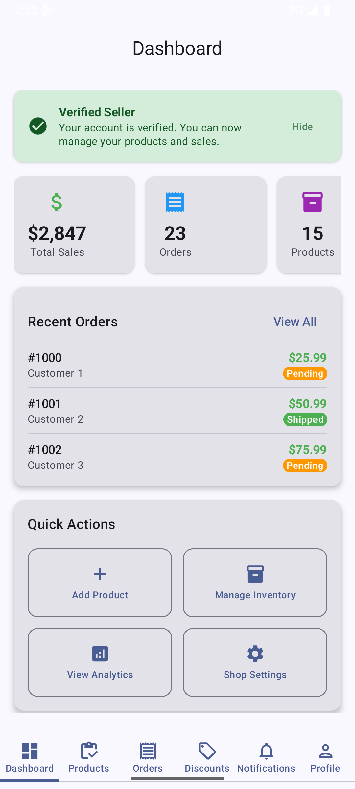
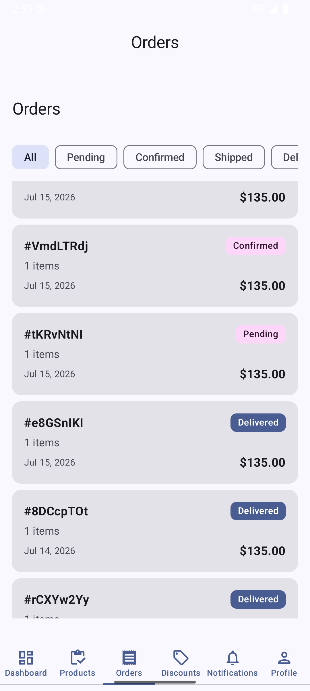
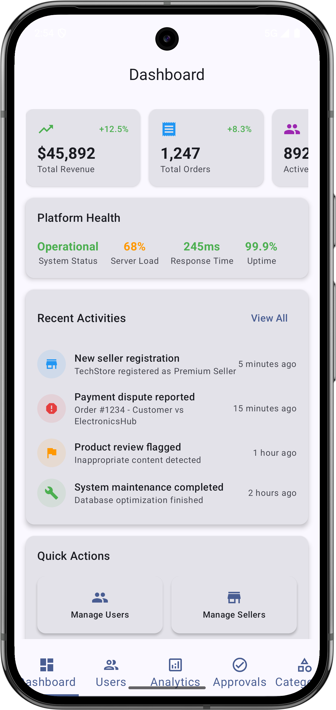
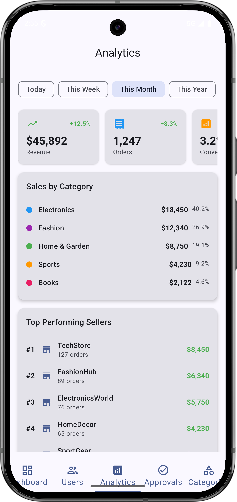
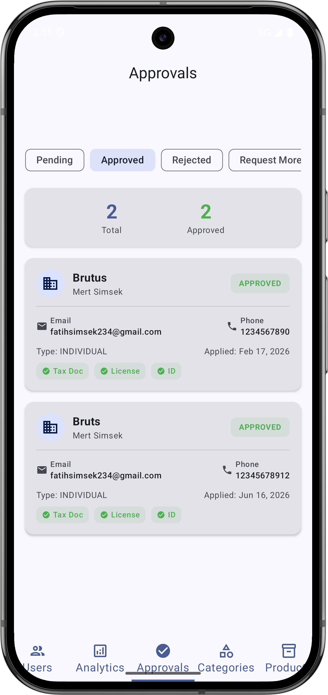

# WenuCommerce

A full-featured Android e-commerce application built with Kotlin and Jetpack Compose. Three user roles (Customer, Seller, Admin), real-time Firebase backend, offline-first caching with Room, and a multi-module Clean Architecture setup.

## Screenshots

<p align="center">



</p>
<p align="center">



</p>

## Architecture

The project follows **Clean Architecture** with a multi-module structure:

```
WenuCommerce/
├── app/        → UI layer: Jetpack Compose screens, ViewModels, navigation
├── data/       → Data layer: Firebase repositories, Room DAOs, mappers
├── domain/     → Domain layer: models, repository interfaces, use cases
└── functions/  → Firebase Cloud Functions (notifications, seller triggers)
```

**Presentation pattern:** MVI with `UiState` sealed classes and unidirectional data flow.  
**Dependency injection:** Koin across all modules, keeping the domain layer framework-independent.

## Features

**Customer**
- Product browsing with search and filtering
- Product detail with reviews
- Cart and wishlist management
- Checkout flow with address entry and coupon support
- Order placement, history, and tracking
- Seller storefronts and follow system
- Push notifications (FCM)

**Seller**
- Product CRUD (create, edit, delete)
- Order management with status updates
- Discount/coupon creation and management
- Dashboard with sales overview
- KYC/verification flow
- Review management

**Admin**
- User management and seller approval
- Product moderation and search
- Category management
- Analytics dashboard
- Platform settings and cross-seller discounts

## Tech Stack

| Layer | Tech |
|---|---|
| UI | Jetpack Compose, Material 3 |
| Architecture | Multi-module Clean Architecture, MVI |
| DI | Koin |
| Backend | Firebase (Firestore, Auth, Cloud Functions, FCM) |
| Local storage | Room (offline-first caching) |
| Payments | Stripe (scaffolded) |
| Async | Kotlin Coroutines, Flow |
| Build | Gradle Kotlin DSL |

## Building locally

**Prerequisites:** Android Studio Hedgehog or later, JDK 17+, a Firebase project with Firestore and Auth enabled.

1. Clone the repository:
   ```
   git clone https://github.com/wenubey/WenuCommerce.git
   ```
2. Open the project in Android Studio.
3. Add your own `google-services.json` to the `app/` directory (Firebase console → Project settings → Android app).
4. Sync Gradle and run on an emulator or device (API 26+).

> **Note:** The app requires a Firebase backend. Without `google-services.json`, the build will fail. If you need access to the existing Firebase project for review purposes, please reach out.

## Project Stats

- **36,000+** lines of Kotlin across **477** files
- **15** Firebase-backed repositories
- **3** user roles with distinct navigation graphs
- **Multi-module** setup: `app` (28.8k LOC), `data` (6k LOC), `domain` (1.3k LOC)
- Build status: `assembleDebug` passes clean

## Status

This is an actively developed project. Core e-commerce flows (browse → cart → checkout → order) are fully functional. UI is functional but not yet polished — the focus so far has been on architecture, data layer reliability, and feature completeness.

## License

This project is not open-source. All rights reserved.
